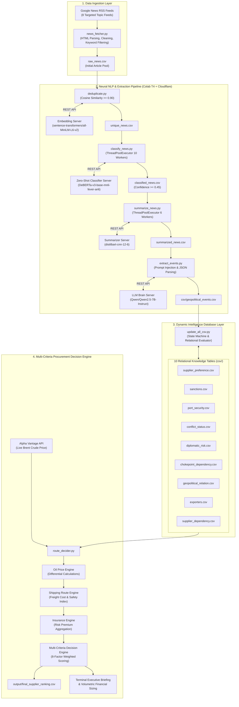
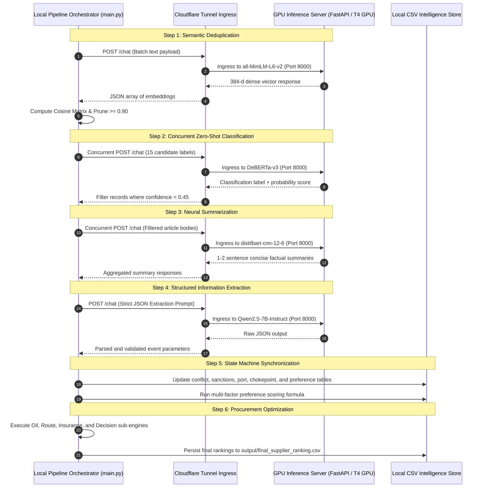
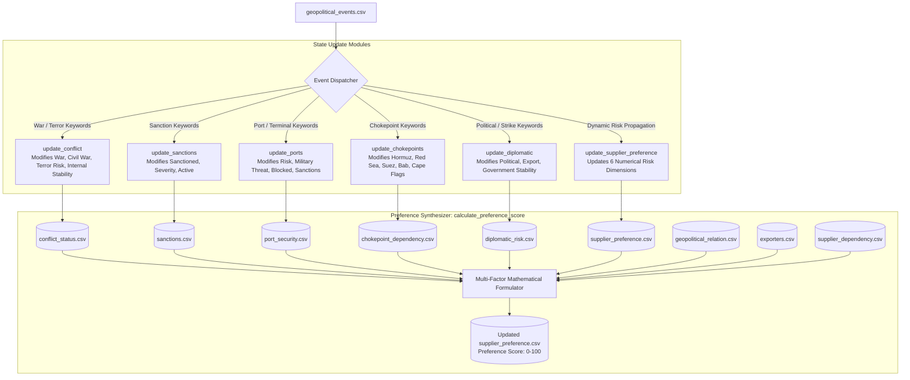
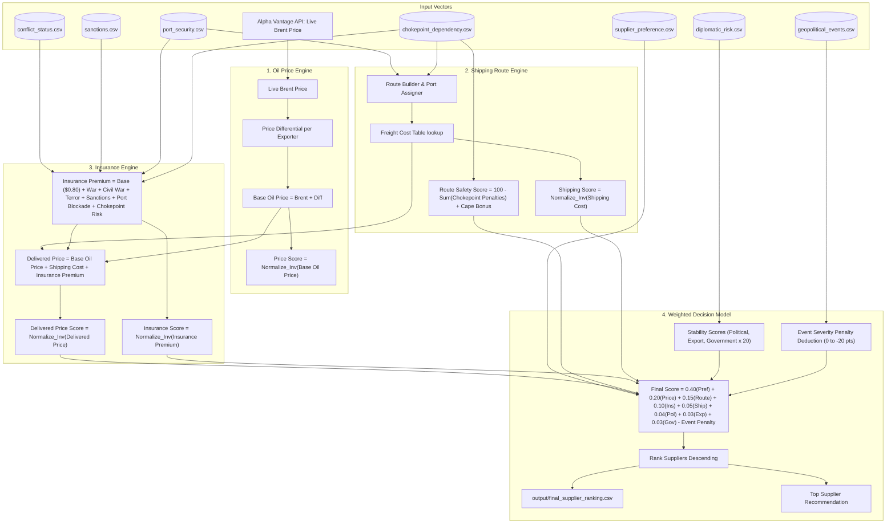
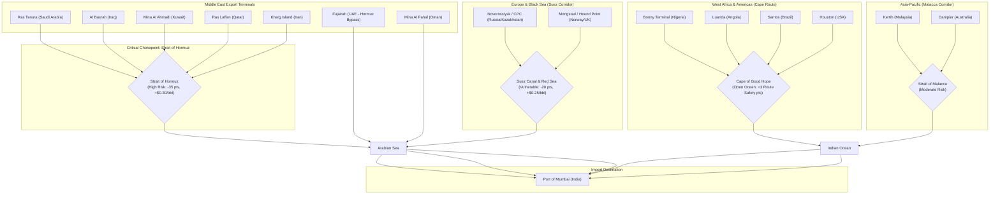

# System Architecture: AI-Driven Energy Supply Chain Resilience

## 1. Architectural Overview

The AI-Driven Energy Supply Chain Resilience system is engineered as a hybrid distributed decision intelligence platform. It ingests high-frequency unstructured geopolitical news feeds, passes them through a four-stage neural natural language processing (NLP) pipeline, updates a relational state machine of global energy suppliers and maritime infrastructure, and computes an optimal oil procurement strategy using a multi-criteria mathematical optimization engine.

The platform separates compute-heavy deep learning inference from local deterministic business logic through an asynchronous hybrid cloud topology.



---

## 2. Distributed Hybrid Client-Server Infrastructure

Due to the compute requirements of hosting multiple transformer models (ranging from lightweight embedding models to 7-billion parameter generative LLMs), the architecture adopts a zero-marginal-cost decoupled design. The heavy inference tasks run on cloud GPU worker instances (such as Google Colab T4 runtimes), exposed securely via Cloudflare Tunnels (`trycloudflare.com`). The local orchestrator executes lightweight data manipulation, concurrent request pooling, state updates, and deterministic optimization.



---

## 3. NLP Pipeline & Data Flow Architecture

The data transformation pipeline converts noisy external RSS articles into clean, structured geopolitical facts with high precision and low token overhead.

```mermaid
flowchart LR
    subgraph S1 [Phase 1: Ingestion]
        A[RSS Feed URLs] -->|feedparser| B[HTML Stripping\nBeautifulSoup]
        B -->|Regex Normalization| C[Keyword Filter\n27 Energy Terms]
        C -->|raw_news.csv| D[Raw Articles]
    end

    subgraph S2 [Phase 2: Deduplication]
        D -->|Vector Generation| E[all-MiniLM-L6-v2]
        E -->|Cosine Similarity Matrix| F{Score >= 0.90?}
        F -->|Yes| G[Keep Longest Article]
        F -->|No| H[Retain Both]
        G & H -->|unique_news.csv| I[Deduplicated Stream]
    end

    subgraph S3 [Phase 3: Classification]
        I -->|Parallel Workers: 10| J[DeBERTa-v3 Classifier]
        J -->|15 Geopolitical Classes| K{Confidence >= 0.45?}
        K -->|No| L[Discard Noise]
        K -->|Yes| M[classified_news.csv]
    end

    subgraph S4 [Phase 4: Summarization]
        M -->|Parallel Workers: 6| N[distilbart-cnn-12-6]
        N -->|Factual Compression| O[summarized_news.csv]
    end

    subgraph S5 [Phase 5: Extraction]
        O -->|System Prompt Template| P[Qwen2.5-7B-Instruct]
        P -->|Regex Sanitization| Q[JSON Validation Engine]
        Q -->|geopolitical_events.csv| R[Structured Event Stream]
    end

    S1 --> S2 --> S3 --> S4 --> S5
```



### Event Extraction JSON Contract

The interface contract between the unstructured news summarizer and `Qwen 2.5-7B` requires the model to output a schema-compliant JSON document:

```json
{
  "country": "Iran",
  "actor": "IRGC Navy",
  "event_type": "Shipping Attack",
  "severity": 4,
  "political_risk": 4,
  "export_risk": 5,
  "india_affected": true,
  "affected_exporters": ["Iraq", "Kuwait", "Saudi Arabia", "UAE", "Qatar"],
  "affected_ports": ["Kharg Island", "Ras Tanura", "Al Basrah"],
  "affected_chokepoints": ["Strait of Hormuz"],
  "sanction": false,
  "reason": "IRGC seized foreign commercial tanker transiting the Strait of Hormuz claiming maritime violations."
}
```

---

## 4. Geopolitical State Machine & Knowledge Graph Architecture

When new events are extracted, `update_all_csv.py` acts as a state machine that propagates risk adjustments across the permanent database tables.



### State Machine Transition Rules

1. **Conflict Escalation**:
   - `War` token detected in event text $\rightarrow$ `War = Yes`.
   - `Civil` token detected $\rightarrow$ `Civil War = Yes`.
   - Severity $\ge 8 \rightarrow \text{Internal Stability} = \text{Very Low}$, $\text{Terror Risk} = \text{Very High}$.
   - Severity $\ge 6 \rightarrow \text{Internal Stability} = \text{Low}$, $\text{Terror Risk} = \text{High}$.
   - Severity $\ge 4 \rightarrow \text{Internal Stability} = \text{Medium}$, $\text{Terror Risk} = \text{Medium}$.

2. **Sanction Tracking**:
   - `Sanction` token detected $\rightarrow$ `Sanctioned = Yes`, `Active = Yes`.
   - Severity mapped to `Low`, `Medium`, `High`, or `Very High`.

3. **Port & Terminal Security**:
   - Port/Terminal tokens with attack/missile/drone/naval keywords trigger immediate elevation of `Risk` and `Military Threat`.
   - `Blocked` or `Closure` tokens $\rightarrow$ `Blocked = Yes`.

4. **Chokepoint Dependency Mapping**:
   - Detected incidents in `Hormuz`, `Red Sea`, `Suez`, `Bab-el-Mandeb`, or `Cape Route` set corresponding maritime dependency flags to `Yes`.

---

## 5. Decision Engine Mathematical Formulation

The Procurement Decision Engine in `route_decider.py` implements an 8-criteria multi-attribute decision model (MADM) integrated with live commodity spot prices and maritime freight routing equations.



### Mathematical Equations

#### 1. Route Safety Formulation
$$\text{Route Safety} = \text{Clamp}_{0}^{100}\left(100 - 12(H) - 10(RS) - 8(BM) - 6(SZ) + 3(CR)\right)$$
Where:
- $H$: Hormuz dependency ($1.0$ for Yes, $0.5$ for Partial, $0.0$ for No)
- $RS$: Red Sea dependency ($1.0$ for Yes, $0.5$ for Partial, $0.0$ for No)
- $BM$: Bab-el-Mandeb dependency ($1.0$ for Yes, $0.5$ for Partial, $0.0$ for No)
- $SZ$: Suez Canal dependency ($1.0$ for Yes, $0.5$ for Partial, $0.0$ for No)
- $CR$: Cape of Good Hope open ocean transit ($1.0$ for Yes, $0.5$ for Partial, $0.0$ for No)

#### 2. Insurance Premium Formulation
$$\text{Insurance Premium (\$/bbl)} = P_{\text{base}} + C_{\text{war}} + C_{\text{civil}} + C_{\text{terror}} + C_{\text{sanction}} + C_{\text{port}} + C_{\text{choke}}$$
Where:
- $P_{\text{base}} = \$0.80$
- $C_{\text{war}} = \$0.60$ if active war
- $C_{\text{civil}} = \$0.50$ if active civil war
- $C_{\text{terror}} \in \{\$0.40, \$0.30, \$0.15, \$0.05, \$0.00\}$ based on threat level
- $C_{\text{sanction}} = \$0.40$ if active sanctions
- $C_{\text{port}} = \$0.40$ if port blocked, $\$0.20$ if partially blocked
- $C_{\text{choke}} = 0.30(H) + 0.25(RS) + 0.25(BM) + 0.20(SZ)$

#### 3. Total Delivered Price
$$\text{Delivered Price (\$/bbl)} = \text{Base Oil Price} + \text{Shipping Freight Cost} + \text{Insurance Premium}$$

#### 4. Multi-Criteria Final Scoring
$$\text{Final Score} = \sum_{i=1}^{8} \left(w_i \times S_i\right) - \Delta_{\text{event}}$$
Weights ($w_i$):
- $\text{Preference Score}: 40\%$
- $\text{Delivered Price Score}: 20\%$
- $\text{Route Safety Score}: 15\%$
- $\text{Insurance Score}: 10\%$
- $\text{Shipping Score}: 5\%$
- $\text{Political Stability Score}: 4\%$
- $\text{Export Stability Score}: 3\%$
- $\text{Government Stability Score}: 3\%$

Event Deduction ($\Delta_{\text{event}}$):
- Maximum Event Severity $\ge 5 \implies -20\text{ points}$
- Maximum Event Severity $= 4 \implies -15\text{ points}$
- Maximum Event Severity $= 3 \implies -8\text{ points}$
- Maximum Event Severity $= 2 \implies -4\text{ points}$
- Maximum Event Severity $< 2 \implies 0\text{ points}$

---

## 6. Maritime Logistics & Chokepoint Topology

The maritime model evaluates global shipping lanes connecting export terminals across Africa, the Middle East, the Americas, Europe, and Asia-Pacific to the Port of Mumbai (Nhava Sheva / Jawahar Dweep terminal).



---

## 7. Failure Handling & Resilience Mechanisms

| Layer | Potential Failure | Handling & Mitigation Strategy |
| :--- | :--- | :--- |
| **Ingestion** | RSS endpoint unavailable or connection timeout | `feedparser` ignores unreachable endpoints; pipeline proceeds with available feeds. |
| **Deduplication** | Embedding server timeout or Cloudflare error | Falls back to preserving original record order without crashing downstream tasks. |
| **Classification** | Zero-shot model outputs invalid JSON or low score | Output is sanitized using regex and filtered out if score is below the 0.45 threshold. |
| **Summarization** | DistilBART server rate limit or worker error | Unsummarized article text is passed through fallback truncation to prevent data loss. |
| **LLM Brain** | Generative model outputs non-JSON markdown wrapper | `re.search(r"\{.*\}", re.DOTALL)` extracts embedded JSON, stripping markdown code fences. |
| **Oil Pricing** | Alpha Vantage API quota exhausted or network error | Automatically falls back to calibrated default spot benchmark ($78.40/barrel). |
| **Decision Engine** | Missing exporter record in diplomatic or port tables | Default baseline safety parameters are assigned to prevent NaN propagation. |
