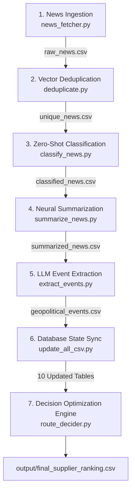

# AI-Driven Energy Supply Chain Resilience for Import-Dependent Economies

## 1. Executive Summary & Problem Context

India imports approximately **88% of its crude oil**, with **40% to 45%** of that volume transiting through the **Strait of Hormuz**. This creates a critical structural vulnerability that is repeatedly exposed during geopolitical crises, regional conflicts, and maritime blockades along critical shipping corridors (e.g., the Strait of Hormuz, Bab el-Mandeb, and the Red Sea).

India's **Strategic Petroleum Reserves (SPR)** provide approximately **9.5 days** of national consumption cover. Sustained supply disruptions or logistical chokepoint closures pose immediate threats to industrial productivity, macroeconomic stability, and energy security. Empirical supply chain studies indicate that economies lacking automated rerouting and dynamic procurement intelligence require an average of **47 days longer** to stabilize supply operations during crises than those utilizing integrated decision systems.

This repository implements an autonomous, AI-driven decision intelligence system designed to:
1. Ingest and filter real-time geopolitical, logistical, and energy market news feeds.
2. Deduplicate, classify, summarize, and extract structured crisis events using a four-stage neural pipeline.
3. Maintain an active relational state machine tracking geopolitical relations, port security, conflict levels, sanction status, and chokepoint dependencies across global crude suppliers.
4. Execute a **Multi-Criteria Procurement Decision Engine** integrating spot crude prices, shipping freight rates, risk-adjusted maritime insurance premiums, and geopolitical stability indices to deliver optimized supplier rankings and cargo cost analyses.
5. Operate via a distributed zero-cost architecture utilizing free-tier T4 GPUs (Google Colab) and Cloudflare Tunnels for model inference, coordinated by a local Python execution engine.

For comprehensive architectural flowcharts and data flow diagrams, refer to [ARCHITECTURE.md](ARCHITECTURE.md).

---

## 2. Repository Structure

```
AI-Driven-Energy-Supply-Chain-Resilience/
├── ARCHITECTURE.md                  # Detailed architectural diagrams, schemas, and state transitions
├── README.md                        # Primary project documentation and execution guide
├── main.py                          # Master orchestration pipeline executing all sub-modules
├── news_fetcher.py                  # Ingestion engine for Google News RSS feeds with keyword filtering
├── deduplicate.py                   # Semantic deduplication using dense vector embeddings (cosine >= 0.90)
├── classify_news.py                 # Multi-threaded zero-shot event classifier (DeBERTa-v3)
├── summarize_news.py                # Multi-threaded neural text summarization (DistilBART)
├── extract_events.py                # Structured intelligence and parameter extraction (Qwen 2.5-7B)
├── update_all_csv.py                # Dynamic intelligence database state machine & preference scorer
├── route_decider.py                 # Multi-criteria decision engine, pricing, shipping, & insurance
├── raw_news.csv                     # Pipeline intermediate: Raw extracted news articles
├── unique_news.csv                  # Pipeline intermediate: Deduplicated news articles
├── classified_news.csv              # Pipeline intermediate: Filtered & categorized news articles
├── summarized_news.csv              # Pipeline intermediate: AI-summarized news briefs
│
├── csv/                             # Permanent Relational Intelligence Database (10 Stateful CSVs)
│   ├── chokepoint_dependency.csv    # Maritime chokepoint transit requirements per exporting country
│   ├── conflict_status.csv          # War, civil war, terror, and internal stability metrics
│   ├── diplomatic_risk.csv          # Political, export, and government stability ratings
│   ├── exporters.csv                # Baseline exporter profiles, capacities, crude grades, and trade links
│   ├── geopolitical_events.csv      # Persistent audit log of extracted geopolitical events
│   ├── geopolitical_relation.csv    # Bilateral diplomatic alignment scores (India, USA, Iran, etc.)
│   ├── port_security.csv            # Terminal-level operational status, military threats, and blockades
│   ├── sanctions.csv                # International trade sanctions, imposing entities, and severity
│   ├── supplier_dependency.csv      # India import percentages and supplier spare production capacities
│   └── supplier_preference.csv      # Dynamic risk ratings and calculated supplier preference scores
│
├── Model/                           # Local API client wrappers connecting to Cloudflare endpoints
│   ├── __init__.py                  # Python package initialization
│   ├── classifier.py                # Client wrapper for DeBERTa-v3 Zero-Shot Classifier
│   ├── embedding.py                 # Client wrapper for all-MiniLM-L6-v2 Embedding Server
│   ├── qwen.py                      # Client wrapper for Qwen 2.5-7B-Instruct LLM Brain
│   └── summarizer.py                # Client wrapper for DistilBART-CNN-12-6 Summarizer
│
├── External_Server_run_on_colab/    # Google Colab GPU server notebooks (FastAPI + Cloudflare)
│   ├── classifier.ipynb             # DeBERTa-v3 zero-shot classification server notebook
│   ├── embedding.ipynb              # all-MiniLM-L6-v2 sentence embedding server notebook
│   ├── LLM.ipynb                    # Qwen 2.5-7B-Instruct generative LLM server notebook
│   └── sumarize.ipynb               # DistilBART text summarization server notebook
│
└── output/                          # Decision Engine Output Artifacts
    └── final_supplier_ranking.csv   # Final ranked supplier list with delivered prices & scores
```

---

## 3. End-to-End System Pipeline

The pipeline processes geopolitical and market signals through a seven-step execution sequence:



### 3.1. News Ingestion (`news_fetcher.py`)
- Ingests articles from 8 Google News RSS feeds targeting geopolitical and energy security queries (`Strait of Hormuz`, `Iran Oil`, `Red Sea Shipping`, `OPEC`, `Saudi Oil`, `Russia Oil`, `Global Energy Security`, `Iran Sanctions`).
- Strips HTML markup using `BeautifulSoup` and normalizes whitespace.
- Applies keyword filtering against 27 energy, shipping, and geopolitical tokens (e.g., `crude`, `tanker`, `sanction`, `hormuz`, `suez`, `pipeline`, `refinery`).
- Removes redundant title matches and writes results to `raw_news.csv`.

### 3.2. Vector Semantic Deduplication (`deduplicate.py`)
- Sends article text to the `sentence-transformers/all-MiniLM-L6-v2` embedding server to generate 384-dimensional dense semantic vectors.
- Computes pairwise cosine similarity across all ingested items.
- Articles with similarity score $\ge 0.90$ are flagged as duplicates. The longer, more comprehensive article is preserved.
- Outputs deduplicated records to `unique_news.csv`.

### 3.3. Zero-Shot Event Classification (`classify_news.py`)
- Dispatches concurrent HTTP requests (`ThreadPoolExecutor` with 10 workers) to the `DeBERTa-v3` zero-shot classification server.
- Categorizes articles against 15 candidate labels: `Military Attack`, `Shipping Attack`, `Sanctions`, `Political Instability`, `Port Closure`, `Oil Production Cut`, `Oil Production Increase`, `Trade Agreement`, `Diplomatic Meeting`, `Natural Disaster`, `Cyber Attack`, `Pipeline Damage`, `Port Congestion`, `Oil Export Restriction`, and `Other`.
- Filters out noise by enforcing a strict confidence threshold (`score >= 0.45`).
- Writes categorized data to `classified_news.csv`.

### 3.4. Neural Text Summarization (`summarize_news.py`)
- Submits classified article bodies to the `distilbart-cnn-12-6` summarization server via multi-threaded execution (6 workers).
- Compresses unstructured text into concise 1-2 sentence factual briefs, optimizing context windows and reducing processing latency for downstream LLM parsing.
- Saves results to `summarized_news.csv`.

### 3.5. Structured Intelligence Extraction (`extract_events.py`)
- Prompts `Qwen 2.5-7B-Instruct` with a zero-shot extraction template.
- Generates a structured JSON object containing 12 critical geopolitical parameters:
  - `country`: Location of the incident.
  - `actor`: Primary entity involved (military, militia, government).
  - `event_type`: Categorized incident type.
  - `severity`: Disruption severity rated on a scale of 0 to 5.
  - `political_risk`: Estimated political instability (0-5).
  - `export_risk`: Direct oil production/export impact (0-5).
  - `india_affected`: Boolean indicator of direct impact on Indian imports.
  - `affected_exporters`: List of exporting nations impacted.
  - `affected_ports`: Specific export terminals affected.
  - `affected_chokepoints`: Maritime straits compromised (`Strait of Hormuz`, `Bab el-Mandeb`, `Suez Canal`, `Red Sea`, etc.).
  - `sanction`: Boolean flag for sanctions imposition.
  - `reason`: Concise summary statement (under 30 words).
- Validates and parses JSON blocks using robust regex extraction and persists records to `csv/geopolitical_events.csv`.

### 3.6. Dynamic Database Synchronization (`update_all_csv.py`)
- Reads the extracted event stream and updates the 10 permanent CSV relational tables.
- Evaluates rule-based state transitions for conflict status, diplomatic risk ratings, port security levels, and chokepoint transit risks.
- Computes composite Geopolitical Preference Scores for all suppliers based on baseline export stability, bilateral alignment, spare capacity, chokepoint penalties, and cargo cancellation history.

### 3.7. Procurement Decision Engine (`route_decider.py`)
- Ingests updated intelligence tables and queries real-time Brent crude spot prices.
- Executes four specialized sub-engines:
  - **Oil Price Engine**: Calculates base crude cost using exporter quality differentials.
  - **Shipping Route Engine**: Maps maritime routing to Mumbai and evaluates route safety scores.
  - **Insurance Engine**: Calculates risk-adjusted insurance premiums incorporating war risk, sanctions, port threats, and chokepoint exposure.
  - **Multi-Criteria Decision Engine**: Computes weighted scores across 8 operational criteria and applies event severity deductions.
- Persists final rankings to `output/final_supplier_ranking.csv` and outputs terminal financial sizing reports.

---

## 4. Machine Learning & Model Hierarchy

The system utilizes four distinct models hosted on GPU instances and accessed via REST endpoints:

| Role | Model Identifier | Architecture / Parameters | Hosting Runtime | Function in Pipeline |
| :--- | :--- | :--- | :--- | :--- |
| **Embedding Server** | `sentence-transformers/all-MiniLM-L6-v2` | Transformer / 22M Params | Google Colab (T4) | Generates 384-dimensional vector embeddings for cosine similarity deduplication. |
| **Classifier Server** | `MoritzLaurer/DeBERTa-v3-base-mnli-fever-anli` | DeBERTa-v3 / 86M Params | Google Colab (T4) | Performs zero-shot classification across 15 supply chain disruption classes. |
| **Summarizer Server** | `sshleifer/distilbart-cnn-12-6` | DistilBART / 306M Params | Google Colab (T4) | Condenses raw article text into 1-2 sentence factual briefs. |
| **LLM Brain Server** | `Qwen/Qwen2.5-7B-Instruct` | Autoregressive LLM / 7B Params | Google Colab (T4) | Extracts structured 12-parameter JSON representations of geopolitical events. |

### Server Implementation Architecture

Each notebook in `External_Server_run_on_colab/` exposes a FastAPI service:

```python
from fastapi import FastAPI
from pydantic import BaseModel
import uvicorn

app = FastAPI()

class ChatRequest(BaseModel):
    message: str

@app.post("/chat")
def process(request: ChatRequest):
    # Model inference logic
    return {"response": result}

# Ingress via Cloudflare Tunnel
# !cloudflared tunnel --url http://127.0.0.1:8000
```

---

## 5. Intelligence Database: CSV Data Dictionary

The intelligence state machine maintains 10 permanent relational CSV files and 4 pipeline execution CSV files.

### 5.1. Permanent Knowledge Tables (`csv/`)

#### 1. `csv/geopolitical_events.csv`
Persistent audit log of all extracted geopolitical disruptions.
- `country`: Impacted nation.
- `actor`: Instigating entity or force.
- `event_type`: Categorized incident class.
- `severity`: Numerical impact score (0 to 5).
- `political_risk` / `export_risk`: Dimension risk scores (0 to 5).
- `india_affected`: Boolean impact indicator.
- `affected_exporters` / `affected_ports` / `affected_chokepoints`: String list of affected entities.
- `sanction`: Boolean flag for sanction events.
- `reason`: Concise narrative explanation.
- `title` / `published` / `link` / `summary`: Source article metadata.

#### 2. `csv/supplier_preference.csv`
Core state table tracking supplier risk indicators and calculated preference scores.
- `Country`: Exporting nation name.
- `Preference Score`: Calculated composite preference score (0 to 100).
- `Political Risk`, `Sanction Risk`, `Conflict Risk`, `Port Risk`, `Chokepoint Risk`: Numerical risk metrics (0 to 100).
- `Export Stability`: Exporter production stability rating (0 to 100).
- `Confidence`: Model confidence metric.

#### 3. `csv/sanctions.csv`
Active trade sanctions and restrictive economic measures.
- `Country`: Sanctioned nation.
- `Sanctioned`: Sanctions status (`Yes`/`No`).
- `By Whom`: Imposing authority (e.g., US, EU, UN).
- `Severity`: Sanction severity (`Low`, `Medium`, `High`, `Very High`).
- `Active`: Operational status (`Yes`/`No`).

#### 4. `csv/port_security.csv`
Export terminal operational security and threat status.
- `Port`: Terminal/Port name (e.g., Ras Tanura, Fujairah, Bonny Terminal).
- `Country`: Sovereign jurisdiction.
- `Risk`: General risk level (`Low`, `Medium`, `High`, `Very High`).
- `Military Threat`: Military/militia risk rating (`Low`, `Medium`, `High`, `Very High`).
- `Blocked`: Port blockade status (`Yes`, `Partial`, `No`).
- `Sanctions`: Terminal-specific sanctions flag.

#### 5. `csv/conflict_status.csv`
National conflict and security indicators.
- `Country`: Sovereign nation.
- `War`: International armed conflict flag (`Yes`/`No`).
- `Civil War`: Internal armed conflict flag (`Yes`/`No`).
- `Internal Stability`: Stability rating (`Very Low`, `Low`, `Medium`, `High`).
- `Terror Risk`: Threat level from non-state actors (`Low`, `Medium`, `High`, `Very High`).

#### 6. `csv/diplomatic_risk.csv`
Governance and institutional stability tracking.
- `Country`: Exporting nation.
- `Political Stability`: Rating (`Very Low` to `High`).
- `Export Stability`: Output consistency rating (`Very Low` to `High`).
- `Government Stability`: Sovereign regime stability rating (`Very Low` to `High`).

#### 7. `csv/chokepoint_dependency.csv`
Maritime chokepoint transit requirements to reach India (Port of Mumbai).
- `Country`: Exporter name.
- `Hormuz`: Transit through Strait of Hormuz (`Yes`, `Partial`, `No`).
- `Red Sea`: Transit through Red Sea (`Yes`, `Partial`, `No`).
- `Suez`: Transit through Suez Canal (`Yes`, `Partial`, `No`).
- `Bab-el-Mandeb`: Transit through Bab el-Mandeb (`Yes`, `Partial`, `No`).
- `Cape Route`: Transit via Cape of Good Hope (`Yes`, `No`).

#### 8. `csv/geopolitical_relation.csv`
Bilateral alignment indices.
- `Country`: Exporting nation.
- `Relation with India`: Bilateral diplomatic score (0 to 100).
- `Relation with USA` / `Relation with Iran`: Geopolitical alignment indicators.
- `Relation Score`: Composite diplomatic score.

#### 9. `csv/exporters.csv`
Baseline logistical and crude quality profiles.
- `Country`: Exporter name.
- `Export Capacity`: Daily export capacity in barrels per day (bpd).
- `Production`: Daily domestic production volume.
- `OPEC` / `OPEC+`: Membership status.
- `Crude Grade`: Primary crude benchmark/grade (e.g., Arab Light, Urals, Bonny Light).
- `Current Export to India`: Baseline supply tier (`High`, `Medium`, `Low`, `Spot`).

#### 10. `csv/supplier_dependency.csv`
Indian import reliance and available supplier spare capacity.
- `Country`: Exporter name.
- `India Import %`: Percentage share of total Indian crude imports.
- `Can Increase Export?`: Capacity expansion feasibility (`Yes`/`No`).
- `Spare Capacity`: Available spare capacity in million barrels per day (mbpd).

---

## 6. Mathematical Decision Engine

The Procurement Decision Engine in `route_decider.py` integrates four analytical sub-engines:

### 6.1. Oil Price Sub-Engine
Fetches real-time Brent spot crude pricing $P_{\text{Brent}}$ via the Alpha Vantage API (with a calibrated default fallback of $\$78.40/\text{barrel}$). Exporter-specific crude grade quality differentials $\delta_{\text{country}}$ are applied:

$$P_{\text{base}} = P_{\text{Brent}} + \delta_{\text{country}}$$

| Exporter | Differential ($\delta$) | Representative Grade |
| :--- | :--- | :--- |
| **Russia** | $-\$3.00$ | Urals (Heavy/Sour) |
| **Canada** | $-\$2.00$ | Western Canadian Select (Heavy) |
| **Iraq** | $-\$0.90$ | Basrah Medium |
| **Kuwait** | $-\$0.50$ | Kuwait Export Crude |
| **Saudi Arabia** | $-\$0.40$ | Arab Light |
| **Oman** | $+\$0.10$ | Oman Blend |
| **UAE** | $+\$0.20$ | Murban (Light/Sweet) |
| **Qatar** | $+\$0.30$ | Qatar Marine |
| **United States** | $+\$1.50$ | WTI Midland |
| **Brazil** | $+\$1.80$ | Lula / Tupi Blend |
| **Nigeria** | $+\$2.00$ | Bonny Light (Sweet) |
| **Norway** | $+\$2.50$ | Johan Sverdrup / Brent |

The Base Oil Price is normalized inversely (lower price = higher score):

$$\text{Price Score} = \left(1 - \frac{P_{\text{base}} - \min(P_{\text{base}})}{\max(P_{\text{base}}) - \min(P_{\text{base}})}\right) \times 100$$

### 6.2. Shipping Route Sub-Engine
Calculates freight transit rates $C_{\text{shipping}}$ based on origin distances to Mumbai (ranging from $\$1.90/\text{bbl}$ for UAE to $\$7.20/\text{bbl}$ for the United States). Route safety is modeled as:

$$\text{Route Safety} = \text{Clamp}_{0}^{100}\left(100 - 12 \cdot H - 10 \cdot RS - 8 \cdot BM - 6 \cdot SZ + 3 \cdot CR\right)$$

Where chokepoint transit weights evaluate to:
- $H$ (Hormuz), $RS$ (Red Sea), $BM$ (Bab el-Mandeb), $SZ$ (Suez): $1.0$ for `Yes`, $0.5$ for `Partial`, $0.0$ for `No`.
- $CR$ (Cape Route): $1.0$ for `Yes`, $0.0$ for `No`.

### 6.3. Insurance Sub-Engine
Calculates risk-adjusted marine cargo insurance premiums per barrel:

$$\text{Insurance Premium} = P_{\text{base}} + C_{\text{conflict}} + C_{\text{sanctions}} + C_{\text{port}} + C_{\text{chokepoint}}$$

Where:
- $P_{\text{base}} = \$0.80/\text{bbl}$
- $C_{\text{conflict}} = \$0.60$ (War) $+ \$0.50$ (Civil War) $+ C_{\text{terror}}$ (up to $\$0.40$ for Very High terror threat)
- $C_{\text{sanctions}} = \$0.40$ (if active sanctions apply)
- $C_{\text{port}} = \$0.40$ (Blocked Port) or $\$0.20$ (Partially Blocked Port)
- $C_{\text{chokepoint}} = 0.30 \cdot H + 0.25 \cdot RS + 0.25 \cdot BM + 0.20 \cdot SZ$

The Total Delivered Price is defined as:

$$\text{Delivered Price} = P_{\text{base}} + C_{\text{shipping}} + \text{Insurance Premium}$$

### 6.4. Multi-Criteria Decision Model
Aggregates normalized scores across 8 operational criteria using strategic weights:

$$\text{Final Score} = \sum_{i=1}^{8} \left(w_i \cdot S_i\right) - \Delta_{\text{event}}$$

| Criterion ($i$) | Weight ($w_i$) | Description |
| :--- | :--- | :--- |
| **Preference** | 40% | Dynamic geopolitical alignment, spare capacity, and chokepoint resilience |
| **Delivered Price** | 20% | Inversely normalized delivered price ($P_{\text{base}} + C_{\text{shipping}} + \text{Insurance}$) |
| **Route Safety** | 15% | Maritime lane security and chokepoint bypass capability |
| **Insurance** | 10% | Inversely normalized risk-adjusted insurance premium |
| **Shipping** | 5% | Inversely normalized maritime freight cost |
| **Political Stability** | 4% | Sovereign political stability index |
| **Export Stability** | 3% | Production continuity and terminal output rating |
| **Government Stability** | 3% | Regime and administrative stability rating |

#### Immediate Event Deductions ($\Delta_{\text{event}}$)
To ensure immediate responsiveness to sudden geopolitical shocks, suppliers with recent negative events suffer an absolute deduction:
- Maximum Severity $\ge 5$: **$-20$ points**
- Maximum Severity $= 4$: **$-15$ points**
- Maximum Severity $= 3$: **$-8$ points**
- Maximum Severity $= 2$: **$-4$ points**

Suppliers are ranked by `Final Score` in descending order.

---

## 7. Installation, Configuration & Execution

### 7.1. Prerequisites
- Python 3.9+
- Active Google account for Google Colab (GPU execution)
- Git

### 7.2. Installation
Clone the repository and install dependencies:

```powershell
git clone https://github.com/kajaredhruv433/AI-Driven-Energy-Supply-Chain-Resilience.git
cd AI-Driven-Energy-Supply-Chain-Resilience
pip install pandas numpy requests beautifulsoup4 feedparser scikit-learn tqdm
```

### 7.3. Starting Model Servers on Google Colab
1. Upload notebooks from `External_Server_run_on_colab/` to Google Colab.
2. Select runtime type: **T4 GPU** (`Runtime > Change runtime type > T4 GPU`).
3. Run all cells in each notebook:
   - `embedding.ipynb` (Sentence-Transformers Server)
   - `classifier.ipynb` (DeBERTa-v3 Classifier Server)
   - `sumarize.ipynb` (DistilBART Summarizer Server)
   - `LLM.ipynb` (Qwen 2.5-7B Extraction Server)
4. Copy the public Cloudflare tunnel URL generated by each notebook (e.g., `https://<tunnel-id>.trycloudflare.com`).

### 7.4. Configuring Local API Endpoints
Update the `API_URL` constant in each file under `Model/` with the corresponding tunnel endpoint (appending `/chat`):

- In `Model/embedding.py`:
  ```python
  API_URL = "https://<embedding-tunnel-id>.trycloudflare.com/chat"
  ```
- In `Model/classifier.py`:
  ```python
  API_URL = "https://<classifier-tunnel-id>.trycloudflare.com/chat"
  ```
- In `Model/summarizer.py`:
  ```python
  API_URL = "https://<summarizer-tunnel-id>.trycloudflare.com/chat"
  ```
- In `Model/qwen.py`:
  ```python
  API_URL = "https://<qwen-tunnel-id>.trycloudflare.com/chat"
  ```

### 7.5. Execution
Run the complete pipeline:

```powershell
python main.py
```

---

## 8. Output & Decision Analysis

Upon completion, the system outputs the full decision matrix to `output/final_supplier_ranking.csv` and prints the executive procurement recommendation to the console:

```
================================================================================
AI POWERED GEOPOLITICAL ENERGY INTELLIGENCE SYSTEM
================================================================================

[1/6] Fetching News...
Unique Relevant Articles : 42

[2/6] Removing Duplicates...
Original : 42 | Unique : 31 | Removed : 11

[3/6] Classifying News...
Articles after Classification : 28

[4/6] Summarizing Articles...
Articles Summarized : 28

[5/6] Extracting Events...
Events Extracted : 28

[6/7] Updating Intelligence Database...
Calculating Geopolitical Supplier Preference Scores...

[7/7] Running Procurement Decision Engine...
Brent Price : $78.40/barrel

================================================================================
FINAL PROCUREMENT DECISION
================================================================================
Supplier         : UAE
Export Port      : Fujairah
Shipping Route   : Fujairah -> Arabian Sea -> Mumbai
Delivered Price  : $81.60 per barrel
Total Cost (100K bbl) : $8.16M
Total Cost (1M bbl)   : $81.60M
Total Cost (100M bbl) : $8.16B
Final Score      : 84.65
================================================================================
```

---

## 9. Technologies Used

- **Programming Language**: Python 3.9+
- **Deep Learning & NLP**:
  - `Qwen/Qwen2.5-7B-Instruct` (Information Extraction)
  - `MoritzLaurer/DeBERTa-v3-base-mnli-fever-anli` (Zero-Shot Text Classification)
  - `sshleifer/distilbart-cnn-12-6` (Neural Summarization)
  - `sentence-transformers/all-MiniLM-L6-v2` (Dense Semantic Embeddings)
- **Data Ingestion & Processing**: `feedparser`, `beautifulsoup4`, `pandas`, `numpy`, `scikit-learn`
- **Server & Tunnel Infrastructure**: `FastAPI`, `Uvicorn`, `PyTorch`, `HuggingFace Transformers`, `Cloudflare Tunnels`
- **Market Data**: Alpha Vantage Commodity API
